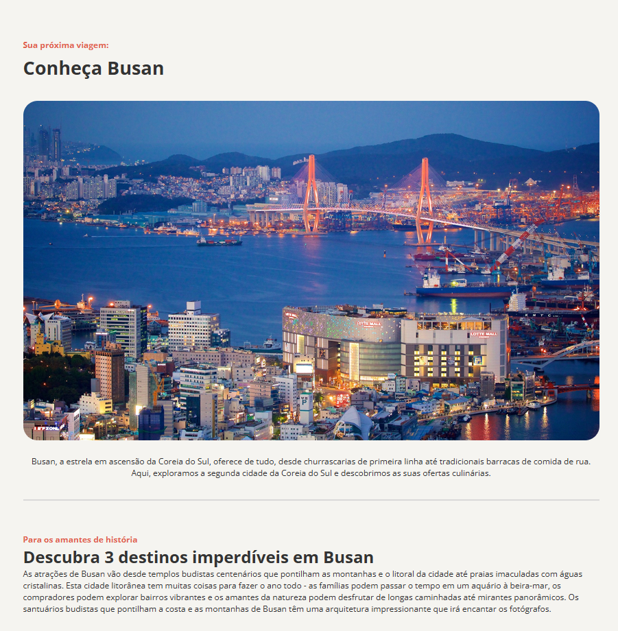

# 💻 Recipe Page

  This project, Tourist site, was created with the goal of practicing and improving fundamental skills in HTML and CSS.

It focuses on building structured web pages using semantic HTML and styling them with modern CSS techniques.

  <a href="https://project-recipes-pearl.vercel.app/">📱 Visit this Project</a>

---

## 🎨 Layout

  

---

## 💻 Technologies

- HTML
- CSS
